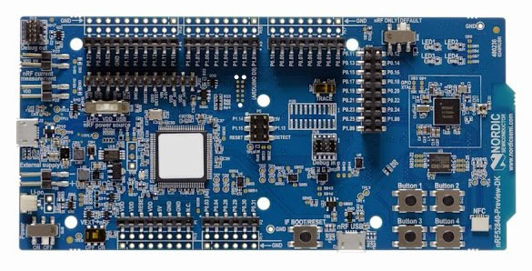
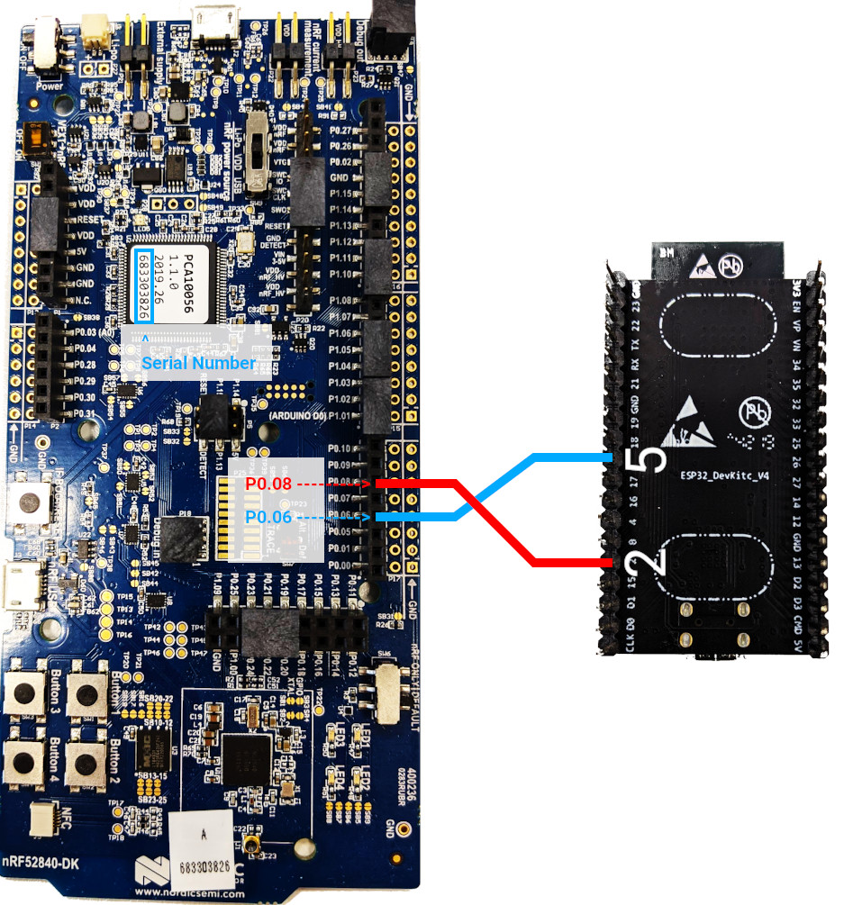

# OpenWeave ESP32 Border Router Demo

A simple demo application showing how to build and use OpenWeave on the Espressif ESP32.

[OpenWeave](https://openweave.io/) is the open source release of Google's Weave technology, the application layer framework that provides a secure, reliable communications backbone for Google's products.
___

- [Supported Setup](#supported-setup)
- [Building the Demo Application](#building-the-demo-application)
- [Pairing](#pairing)
- [Developer Resources](#developer-resources)

___

<a id="supported-setup"></a>

## Supported Setup

The OpenWeave demo application currently works on two categories of ESP32 devices: the [ESP32-DevKitC](https://www.espressif.com/en/products/hardware/esp32-devkitc/overview), and the [M5Stack](https://m5stack.com/).

* ESP32-DevKitC


The ESP32-DevKitC is a small development board containing an ESP-WROOM-32 module plus a power regulator and a Silicon Labs CP2102 USB-to-UART bridge.
The board provides a USB connector for power and host connectivity, two buttons (one for reset and a second for general input) and two LEDs (power and general output).

There are a large number of clone boards manufactured by various third-party companies, many of which can be found online. Of these, the HiLetgo ESP-WROOM-32 ESP-32S development board is one that is known to work and is available for a very reasonable price.

You can find a schematic for the ESP32-DevKitC [here](https://dl.espressif.com/dl/schematics/ESP32-Core-Board-V2_sch.pdf).

* nRF52 series

> This demo uses an nRF52840 DK for the Radio Co-Processor (RCP), but any other platforms that use UART for communication
> can be used. See [OpenThread Vendors](https://openthread.io/vendors) for a list of supported platforms and
> [Build OpenThread](https://openthread.io/guides/build) for information on how to build an RCP for an example platform.



The nRF52840 DK is a versatile single board development kit for Bluetooth Low Energy, Bluetooth mesh, Thread, Zigbee, 802.15.4, ANT and 2.4 GHz proprietary applications on the nRF52840 SoC. It also supports development on the nRF52811 SoC.

___

<a id="building-the-demo-application"></a>

## Building the Demo Application

### Build Openthread RCP

#### Setup nRF52840 developing enviroment

* Install SEGGER J-Link

We use SEGGER J-Link to program the nRF52840 boards, which have onboard JTAG modules. Install this on your Linux machine.

You can find it at https://www.segger.com/downloads/jlink/#J-LinkSoftwareAndDocumentationPack.

Download the appropriate package for your machine, and install it in the proper location. On Linux this is /opt/SEGGER/JLink.

* Install nRF5x Command Line Tools

The nRF5x Command Line Tools allow you to flash the OpenThread binaries to the nRF52840 boards. Install the appropriate nRF5x-Command-Line-Tools-<OS> build on your Linux machine.

You can find it at https://www.nordicsemi.com/Software-and-tools/Development-Tools/nRF-Command-Line-Tools.

Place the extracted package in the root folder ~/

Note: The nRF5x Command Line Tools do not support ARM architectures; therefore, the nRF52840 boards cannot be flashed by ARM-based Linux machines, such as the Raspberry Pi 3B.

* Install ARM GNU Toolchain

The ARM GNU Toolchain is used for building.

You can find it at https://developer.arm.com/tools-and-software/open-source-software/developer-tools/gnu-toolchain/gnu-rm/downloads

We recommend placing the extracted archive in /opt/gnu-mcu-eclipse/arm-none-eabi-gcc/ on your Linux machine. Follow the instructions in the archive's readme.txt file for installation instructions.

#### Build OpenThread

* Clone OpenThread Code

```bash
$ mkdir $HOME/src/ && cd $HOME/src/ 
$ git clone https://github.com/openthread/openthread
$ cd ~/src/openthread
```

* Build and flash nrf52840

```bash
$ make -f examples/Makefile-nrf52840 clean
$ make -f examples/Makefile-nrf52840 CFLAGS="-DUART_HWFC_ENABLED=0"
$ cd ~/src/openthread/output/nrf52840/bin
$ arm-none-eabi-objcopy -O ihex ot-rcp ot-rcp.hex
$ nrfjprog -f nrf52 --chiperase --program ot-rcp.hex --reset
```

> Note: if you have multiple nrf52 boards connected to workstation, specify board serial number in `nrfjprog` command by adding `-s <serial number>`

### Build ESP32

Building the demo application requires the use of the Espressif ESP32 IoT Development Framework and the xtensa-esp32-elf toolchain.
To install these components and build the application, follow these steps:

* Clone the Expressif ESP-IDF and checkout version 3.3

```bash
$ mkdir ${HOME}/tools
$ cd ${HOME}/tools
$ git clone https://github.com/espressif/esp-idf.git
$ cd esp-idf
$ git checkout release/v3.3
$ git submodule update --init
```

* Download and install the appropriate xtensa ESP32 gnu tool chain (ESP-IDF v3.0 requires tool chain version [1.22.0-80-g6c4433a-5.2.0](https://dl.espressif.com/dl/xtensa-esp32-elf-linux64-1.22.0-80-g6c4433a-5.2.0.tar.gz))

```bash
$ cd ${HOME}/tools
$ wget https://dl.espressif.com/dl/xtensa-esp32-elf-linux64-1.22.0-80-g6c4433a-5.2.0.tar.gz
$ tar xzvf xtensa-esp32-elf-linux64-1.22.0-80-g6c4433a-5.2.0.tar.gz
```

* Clone the demo application repository and fetch the referenced submodules.

```bash
$ mkdir ${HOME}/projects
$ cd ${HOME}/projects
$ git clone https://github.com/openweave/openweave-esp32-br.git
$ cd openweave-esp32-br
$ git submodule update --init
```

* Within the demo source directory, create a shell script called `setup.sh` containing paths to the ESP-IDF  and the xtensa toolchain directories created above.

```bash
export IDF_PATH=${HOME}/tools/esp-idf
export ESP32_TOOLS_BIN=${HOME}/tools/xtensa-esp32-elf/bin
export PATH=${ESP32_TOOLS_BIN}:${PATH}
```

* Source the setup.sh script

```bash
source setup.sh
```

* In the root of the source directory, use the `menuconfig` make target to configure the application.

```bash
$ cd ${HOME}/projects/openweave-esp32-demo
$ make menuconfig
```

 * Within the configuration tool, set the following build-time options for your device:

| _Config Setting_ | _Value_ |
| ----------------------- | ---------- |
| **OpenWeave&nbsp;ESP32&nbsp;Demo&nbsp;> &nbsp;&nbsp;Device&nbsp;Type** | Select either `M5Stack` or `ESP32-DevKitC`, depending on the type of your device.|
| **Component&nbsp;Config&nbsp;><br>&nbsp;&nbsp;OpenWeave&nbsp;Device&nbsp;Layer&nbsp;><br>&nbsp;&nbsp;&nbsp;&nbsp;Testing&nbsp;Options&nbsp;><br>&nbsp;&nbsp;&nbsp;&nbsp;&nbsp;&nbsp;Use&nbsp;Test&nbsp;Device&nbsp;Identity** | Choose a unique number between 1 and 255 for your device. This number will become the last byte in the device id for your device - e.g. a value of `15` will result in a device id of `18B430000000000F`. To avoid  confusion, the number chosen must be unique for all devices on your network, as well as all devices that connect to the same  service.|

* Run make to build the demo application

```
make -j
```

* Connect your device via USB. Then run the following command to flash the demo application onto the device and then monitor its output. If necessary, replace `/dev/ttyUSB0` with the correct USB device name for your system.

```
make flash monitor ESPPORT=/dev/ttyUSB0
```

* Connect your ESP32 board and your nRF52 DK board



<br>

___

<a id="pairing"></a>

## Pairing

The device can be paired via either BLE (using Weave-over-BLE) or via the device's WiFi soft-AP.

Upon boot, if the device detects it has not been fully provisioned, it will automatically enable its soft-AP.  By default, the SSID for the device's soft-AP is the string `NEST-xxxx`, where the trailing characters are the last four hex digits of the device's *WiFi* MAC address. One can inspect device log output to see the device's SSID, which is printed whenever it enables the soft-AP.

When BLE support is enabled (the default), the device will periodically send BLE advertisements that are compatible with the Nest BLE advertising format. By default, the device's BLE device name is `Nxxxx`, where the trailing characters are the last four hex digits of the device's Weave node id.

The OpenWeave demp app supports all the necessary Weave profiles to enable full device pairing, including Network Provisioning, Fabric Provisioning, Service Provisioning, Device Identity and Device Control.

#### Pairing Code

By default, the demo application uses the pre-defined pairing code `NESTUS`. This can be overridden by changing the **Component config > OpenWeave Device Layer > Testing Options > Use Test Device Identity** config setting.

<br>

___

## Reset to Defaults

Pressing and holding the attention button for 5 seconds will cause the device to wipe its configuration and reboot.

<br>

___

<a id="developer-resources"></a>

## Developer Resources

Documentation for Expressif's ESP32 development environment can be found here: [ESP-IDF Programming Guide](https://docs.espressif.com/projects/esp-idf/en/latest/esp32/index.html).

Instructions for building and incorporating OpenWeave into a new ESP32 project can be found here: [Building OpenWeave for the ESP32](https://github.com/openweave/openweave-core/blob/master/BUILDING-ESP32.md).
